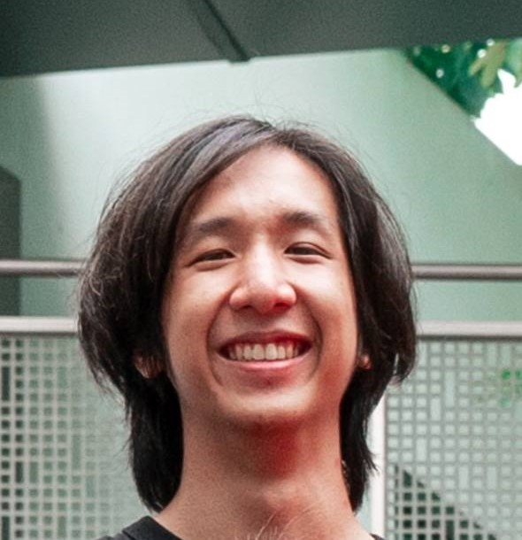

# About Us

We are a team based in the [School of Computing, National University of Singapore](http://www.comp.nus.edu.sg).

You can reach us at the email `seer[at]comp.nus.edu.sg`

## Project team

### John Doe

[[homepage](http://www.comp.nus.edu.sg/~damithch)]
[[github](https://github.com/johndoe)]
[[portfolio](team/johndoe.md)]

* Role: Project Advisor

### Andy Toh

[[github](http://github.com/andytoh1)]
[[portfolio](team/andytoh1.md)]

* Role: Developer
* Responsibilities: Development, Documentation

### Johnny Doe

[[github](http://github.com/johndoe)] [[portfolio](team/johndoe.md)]

* Role: Developer
* Responsibilities: Data

### Wong Xing Hui Bertrand

[[github](http://github.com/peasantbird)]
[[portfolio](team/peasantbird.md)]

* Role: Developer
* Responsibilities: Code Quality

### Ruiyang Zhao

[[github](http://github.com/ruiyangzh)]
[[portfolio](team/ruiyang.md)]

* Role: Developer
* Responsibilities: Developer Testing
