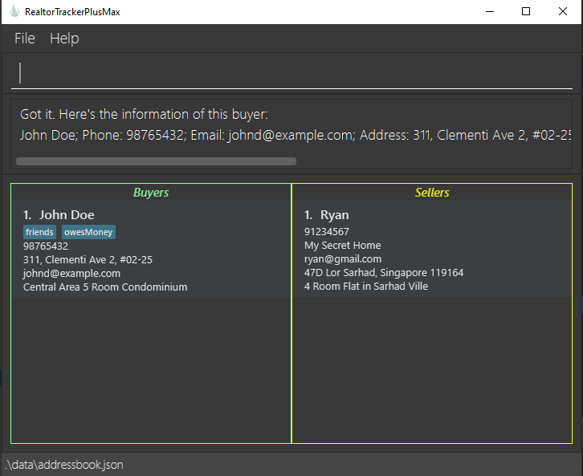

# RTPM User Guide

RealtorTrackerPlusMax (RTPM) is a desktop app for realtors who want to manage contacts, optimized for use via a Line Interface (CLI) while still having the benefits of a Graphical User Interface (GUI). If you can type fast, RTPM can get your contact management tasks done faster than traditional GUI apps.
<!-- * Table of Contents -->
<page-nav-print />

--------------------------------------------------------------------------------------------------------------------

## Quick start

1. Ensure you have Java `11` or above installed in your Computer.

1. Download the latest `rtpm.jar` [here](https://github.com/AY2324S1-CS2103T-F11-3/tp/releases/tag/v1.3(trial)).

1. Copy the file to the folder you want to use as the _home folder_ for your RTPM.

1. Open a command terminal, `cd` into the folder you put the jar file in, and use the `java -jar rtpm.jar` command to run the application.<br>
   A GUI similar to the below should appear in a few seconds. Note how the app contains some sample data.<br>
   

1. Type the command in the command box and press Enter to execute it. e.g. typing **`help`** and pressing Enter will open the help window.<br>
   Some example commands you can try:

    * `buyer n/John Doe p/91234567 e/johndoe@gmail.com ah/1 College Ave East i/Central Area 5 Room Condominium` : Adds a buyer named John Doe to the RTPM.

    * `list-b` : Lists all buyers.

    * `delete-b 2` : Deletes the 2nd buyer shown in the current list.

    * `exit` : Exits the app.

1. Refer to the [Features](#features) below for details of each command.

--------------------------------------------------------------------------------------------------------------------

## Features

<box type="info" seamless>

**Notes about the command format:**<br>

* Words in `UPPER_CASE` are the parameters to be supplied by the user.<br>
  e.g. in `add n/NAME`, `NAME` is a parameter which can be used as `add n/John Doe`.

* Items in square brackets are optional.<br>
  e.g `n/NAME [t/TAG]` can be used as `n/John Doe t/friend` or as `n/John Doe`.

* Items with `…`​ after them can be used multiple times including zero times.<br>
  e.g. `[t/TAG]…​` can be used as ` ` (i.e. 0 times), `t/friend`, `t/friend t/family` etc.

* Parameters can be in any order.<br>
  e.g. if the command specifies `n/NAME p/PHONE_NUMBER`, `p/PHONE_NUMBER n/NAME` is also acceptable.

* Extraneous parameters for commands that do not take in parameters (such as `help`, `list`, `exit` and `clear`) will be ignored.<br>
  e.g. if the command specifies `help 123`, it will be interpreted as `help`.

* If you are using a PDF version of this document, be careful when copying and pasting commands that span multiple lines as space characters surrounding line-breaks may be omitted when copied over to the application.
</box>

### Add a seller : `seller`

Adds a seller with their info to the list.

Format: `seller n/NAME [p/PHONE_NUMBER] [e/EMAIL] [ah/HOME_ADDRESS] [as/SELLING_ADDRESS] [i/SELLING_HOUSE_INFO] [t/TAG]`
- `n/NAME`: String
- `p/PHONE_NUMBER`: int
- `e/EMAIL`: String contains ‘@’
- `ah/HOME_ADDRESS`: String
- `as/SELLING_ADDRESS`: String
- `i/SELLING_HOUSE_INFO`: String
- `[t/TAG]`: Alphanumeric String

Example: `seller n/Ryan p/91234567 e/ryan@gmail.com ah/My Secret Home as/47D Lor Sarhad, Singapore 119164 i/4 Room Flat in Sarhad Ville`

Precise outputs when the command succeeds:
```
Got it. I've added a seller contact:
Ryan; Phone: 91234567; Email: ryan@gmail.com; Address: My Secret Home; Selling Address: 47D Lor Sarhad, Singapore 119164; Sell House Info: 4 Room Flat in Sarhad Ville; Tags:
```

Precise outputs when the command fails due to missing parameters:
```
Invalid command format!
seller: Adds a seller to the address book. Parameters: n/NAME p/PHONE e/EMAIL ah/ADDRESS as/SELLING_ADDRESS i/HOUSE_INFO [t/TAG]...
Example: seller n/Ryan p/91234567 e/ryan@gmail.com ah/My Secret Home as/47D Lor Sarhad, Singapore 119164 i/4 Room Flat in Sarhad Ville t/friends t/owesMoney
```

Precise outputs when the command fails due to invalid parameters:
```
Warning!; [Phone numbers should only contain numbers, and it should be at least 3 digits long. Area codes are allowed, signified by a '+' and up to 3 numbers, followed by a space separating this from the main number.]
Please ignore if this is expected.
```
```
Warning!; [Emails should be of the format local-part@domain and adhere to the following constraints:
1. The local-part should only contain alphanumeric characters and these special characters, excluding the parentheses, (+_.-). The local-part may not start or end with any special characters.
2. This is followed by a '@' and then a domain name. The domain name is made up of domain labels separated by periods.
The domain name must:
    - end with a domain label at least 2 characters long
    - have each domain label start and end with alphanumeric characters
    - have each domain label consist of alphanumeric characters, separated only by hyphens, if any.]
Please ignore if this is expected.
```
```
Emails must contain at least one '@'.
```


### Add a buyer: `buyer`

Adds a buyer with their info to the list.

Format: `buyer n/NAME [p/PHONE\_NUMBER] [e/EMAIL] [ah/HOME\_ADDRESS] [i/BUY\_HOUSE\_INFO] \[t/TAG]`

- `n/NAME`: String
- `p/PHONE\_NUMBER`: int
- `e/EMAIL`: String contains ‘@’
- `ah/ADDRESS`: String
- `i/BUY\_HOUSE\_INFO`: String
- `\[t/TAG]`: Alphanumeric string

Example: 
`buyer n/Jane Doe p/91234567 e/janedoe@gmail.com ah/1 College Ave East i/Central Area 5 Room Condominium`

Precise outputs when the command succeeds:

```
Got it. I've added a buyer contact:
Jane Doe; Phone: 91234567; Email: janedoe@gmail.com; Address: 1 College Ave East; Buying Info: Central Area 5 Room Condominium; Tags:
```

Precise outputs when the command fails due to missing parameters:
```
Invalid command format!
buyer: Adds a buyer to the address book. Parameters: n/NAME p/PHONE e/EMAIL ah/ADDRESS i/INFO [t/TAG]...
Example: buyer n/John Doe p/98765432 e/johnd@example.com ah/311, Clementi Ave 2, #02-25 i/Central Area 5 Room Condominium t/friends t/owesMoney
```

Precise outputs when the command fails due to invalid parameters:
```
Warning!; [Phone numbers should only contain numbers, and it should be at least 3 digits long. Area codes are allowed, signified by a '+' and up to 3 numbers, followed by a space separating this from the main number.]
Please ignore if this is expected.
```
```
Warning!; [Emails should be of the format local-part@domain and adhere to the following constraints:
1. The local-part should only contain alphanumeric characters and these special characters, excluding the parentheses, (+_.-). The local-part may not start or end with any special characters.
2. This is followed by a '@' and then a domain name. The domain name is made up of domain labels separated by periods.
The domain name must:
    - end with a domain label at least 2 characters long
    - have each domain label start and end with alphanumeric characters
    - have each domain label consist of alphanumeric characters, separated only by hyphens, if any.]
Please ignore if this is expected.
```
```
Emails must contain at least one '@'.
```

### Listing all buyers and sellers: `list`

Lists all buyers and sellers that the user has added. Buyers and sellers are stored in separate lists for easier differentiation and handling of contacts.

Format: `list`

Precise outputs when the command succeeds:

```
Listed all buyers and sellers!
```


### Listing all buyers: `listb`

Displays the information of a buyer based on their index number in the buyers' list.

Format: `listb INDEX`

Precise outputs when the command succeeds:

```
Got it. Here's the information of this buyer:
Jane Doe; Phone: 91234567; Email: janedoe@gmail.com; Address: 1 College Ave East; House Info: Central Area 5 Room Condominium; Priority: nil; Tags:
```


### Listing all buyers: `lists`

Displays the information of a seller based on their index number in the sellers' list.

Format: `lists INDEX`

Precise outputs when the command succeeds:

```
Got it. Here's the information of this seller:
Ryan; Phone: 91234567; Email: ryan@gmail.com; Address: My Secret Home; Selling Address: 47D Lor Sarhad, Singapore 119164; House Info: 4 Room Flat in Sarhad Ville; Priority: nil; Tags:
```


### Filter buyers and sellers: `filter`

Lists only all sellers that the user has added.

Format: `filter KEYWORD [MORE_KEYWORDS]`

- `KEYWORD`: String

Precise outputs when the command succeeds:

```
1 buyer(s) and 0 seller(s) listed!
```

### Deleting a buyer: `deleteb`

Deletes a buyer based on their index number in the buyers’ list.

Format: `deleteb INDEX`
* `INDEX`: A positive integer (1,2,3 …) which must not exceed the last index in the buyers' list

Example: `deleteb 3`

Precise outputs when the command succeeds:
```
Got it. I’ve deleted a buyer contact:
Jane Doe; Phone: 91234567; Email: janedoe@gmail.com; Address: 1 College Ave East; House Info: Central Area 5 Room Condominium; Priority: nil; Tags:
```

Precise outputs when the command fails:
```
Invalid command format!
delete-b: Deletes the buyer identified by the index number used in the displayed buyer list.
Parameters: INDEX (must be a positive integer)
Example: deleteb 1
```
```
The buyer index provided is higher than the last number in the list!
```


### Deleting a buyer: `deletes`

Deletes a seller based on their index number in the sellers’ list.

Format: `deletes INDEX`
* `INDEX`: A positive integer (1,2,3 …), which must not exceed last index in the sellers’ list

Example: `deletes 3`

Precise outputs when the command succeeds:
```
Got it. I’ve deleted a seller contact:
Ryan; Phone: 91234567; Email: ryan@gmail.com; Address: My Secret Home; Selling Address: 47D Lor Sarhad, Singapore 119164; House Info: 4 Room Flat in Sarhad Ville; Priority: nil; Tags:
```
Precise outputs when the command fails:
```
Invalid command format!
deleteb: Deletes the buyer identified by the index number used in the displayed buyer list.
Parameters: INDEX (must be a positive integer)
Example: deleteb 1
```
```
The buyer index provided is higher than the last number in the list!
```

### Undo: `undo`

Undoes the previous action.

Format: `undo`

### Redo: `redo`

Restores the previously undone action.

Format :`redo`

### Exiting the program: `exit`

Exits the program.

Format: `exit`


### Clearing all entries : `clear`

Clears all entries from the address book.

Format: `clear`


### Saving the data

RTPM data is saved in the hard disk automatically after any command that changes the data. There is no need to save manually.

### Editing the data file

RTPM data are saved automatically as a JSON file `[JAR file location]/data/rtpm.json`. Advanced users are welcome to update data directly by editing that data file.

<box type="warning" seamless>

**Caution:**
If your changes to the data file are in an invalid format, RTPM will discard all data and start with an empty data file at the next run.
Hence, it is recommended to take a backup of the file before editing it.
</box>

### Archiving data files `[coming in v2.0]`


_Details coming soon ..._

--------------------------------------------------------------------------------------------------------------------

## FAQ

**Q**: How do I transfer my data to another Computer?<br>
**A**: Install the app in the other computer and overwrite the empty data file it creates with the file that contains the data of your previous RTPM home folder.

--------------------------------------------------------------------------------------------------------------------

## Known issues

1. **When using multiple screens**, if you move the application to a secondary screen, and later switch to using only the primary screen, the GUI will open off-screen. The remedy is to delete the `preferences.json` file created by the application before running the application again.

--------------------------------------------------------------------------------------------------------------------

## Command summary

Action     | Format, Examples
-----------|----------------------------------------------------------------------------------------------------------------------------------------------------------------------
**Add Seller**    | `seller n/NAME p/PHONE_NUMBER e/EMAIL ah/HOME_ADDRESS as/SELLING_ADDRESS i/SELLING_HOUSE_INFO [t/TAG]​` <br> e.g., `seller n/Ryan p/91234567 e/ryan@gmail.com ah/My Secret Home as/47D Lor Sarhad, Singapore 119164 i/4 Room Flat in Sarhad Ville`
**Add Buyer**    | `sbuyer n/NAME p/PHONE_NUMBER e/EMAIL ah/HOME_ADDRESS i/BUY_HOUSE_INFO [t/TAG]` <br> e.g., `buyer n/Jane Doe p/91234567 e/janedoe@gmail.com ah/1 College Ave East i/Central Area 5 Room Condominium`
**Clear**  | `clear`
**Delete Buyer** | `delete-b INDEX`<br> e.g., `delete-b 3`
**Delete Seller** | `delete-s INDEX`<br> e.g., `delete-s 3`
**Filter**   | `filter KEYWORD [MORE_KEYWORDS]`<br> e.g., `find James Jake`
**List All** | `list`
**List Seller**   | `lists`
**List Buyer**   | `listb`
**Undo**   | `undo`
**Redo**  | `redo`
**Exit**   | `exit`
**Help**   | `help`

